# Little flipbooks library

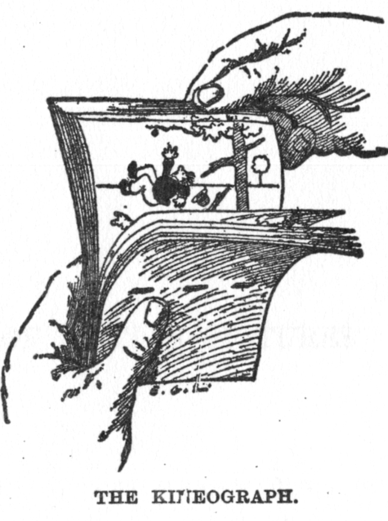


<!-- Original author is de:John Barnes Linnet - Zeitgenössische Illustration (1886), via de.wikipedia -->

The incremental code/result reveal provided by flipbooks may help you
digest longer snippets of code including pipelines and ggplot builds.
Since developing the code-parsing code that allows flipbooking (with Emi
Tanaka and Garrick Aden-Buie), I’ve created many little books; they
don’t seem like they each need their own github repository. Many
smaller flipbooks live here together, while some larger ones have their
own repositories. This webpage/github-readme acts as a directory for
many of the flipbooks.

## DIY

Would you like to make a flipbook? We try to make that easy for you with
{flipbookr}. To get started have a look at [A minimal
Flipbook](https://evamaerey.github.io/little_flipbooks_library/flipbookr/skeleton#1),
the template for which will be available once you install the [flipbooks
package](https://github.com/EvaMaeRey/flipbookr) as follows:

``` r
devtools::install_github("EvaMaeRey/flipbookr")
```

## Background

Interested in flipbooks origin story, and where the project is headed?
Check out our
[about](https://evamaerey.github.io/little_flipbooks_library/about/what_the_flipbook)
page.

## The library

If you need a theoretical exploration of the grammar of graphics and its
use with ggplot2, see [The ggplot2 grammar
guide](https://evamaerey.github.io/ggplot2_grammar_guide/ggplot2_grammar_guide).

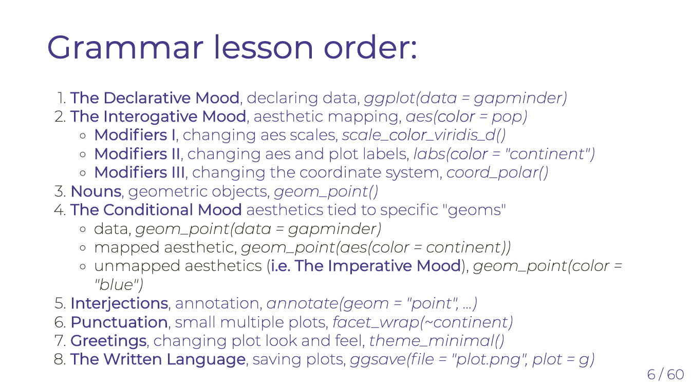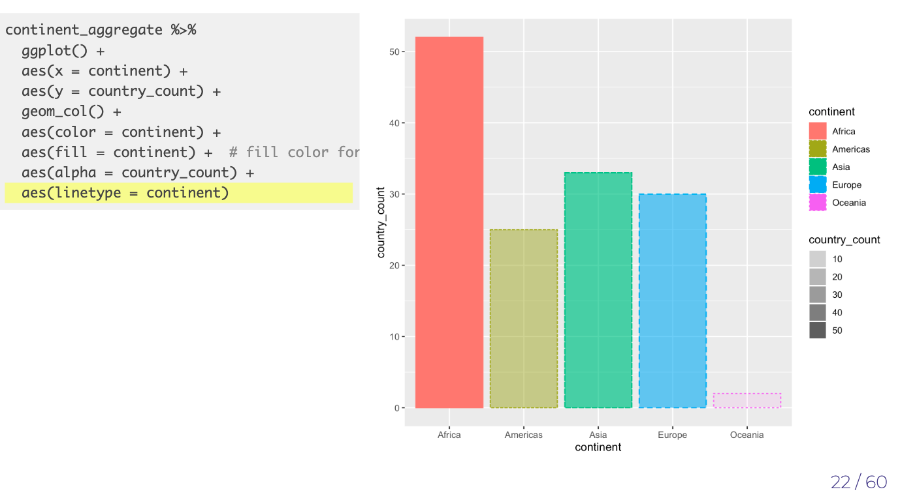

<hr>

A suppliment to this guide shows you a lot of “geoms” that you can use
to communicate about your data is [The geom pile
on](https://evamaerey.github.io/ggplot2_grammar_guide/geoms.html).
You’ll see the pile of different geoms to communicate about the same
data, showing you how these plot types relate to one
another.

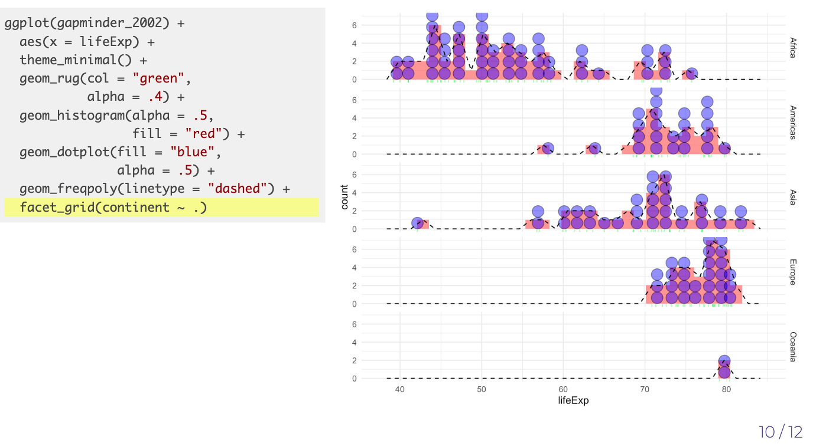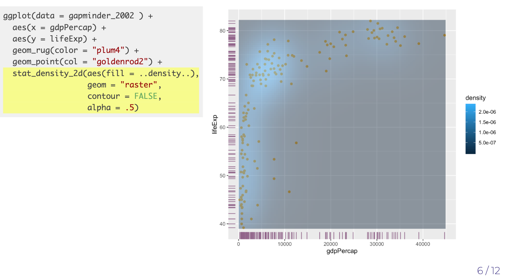

<hr>

For examples of data wrangling/manipulation with pipelines and pipes
(`%>%`), check out [The Tidyverse in
Action](https://evamaerey.github.io/tidyverse_in_action/tidyverse_in_action.html).

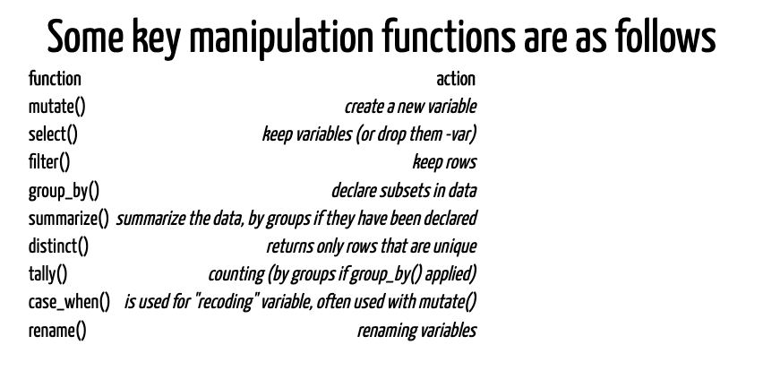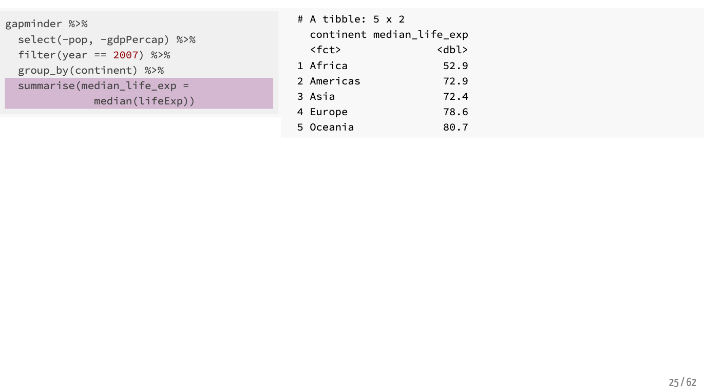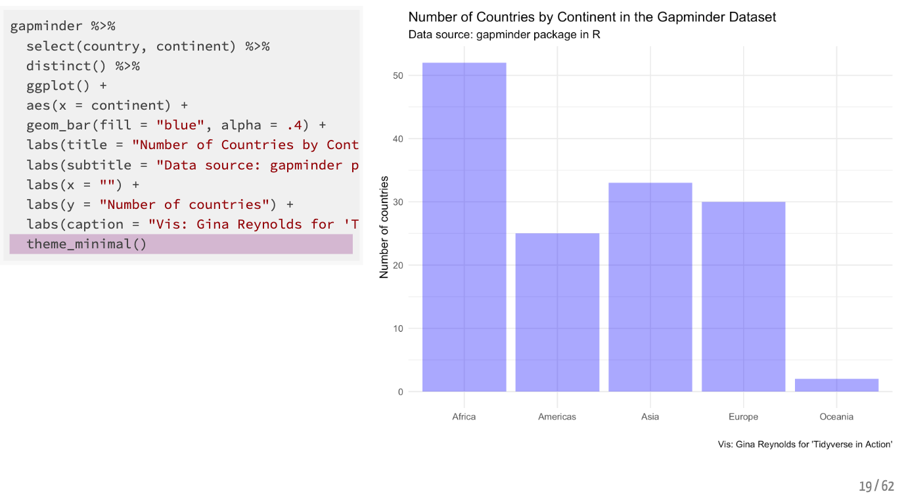

<hr>

For some life-changing, magical, and real-life examples on scanning data
into R and cleaning data (aka tidying up), see [the data cleaning
flipbook](https://evamaerey.github.io/little_flipbooks_library/data_cleaning/data_cleaning).

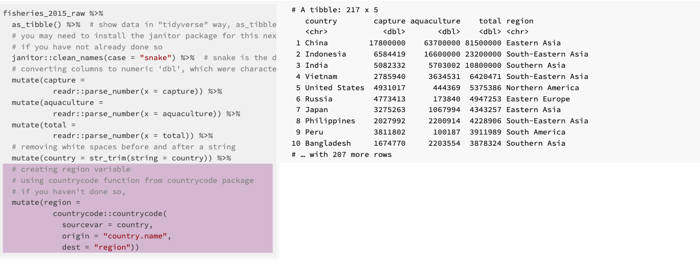

<hr>

And for variety of examples of plot builds using ggplot2, see [the
ggplot
flipbook](https://evamaerey.github.io/ggplot_flipbook/ggplot_flipbook_xaringan.html).

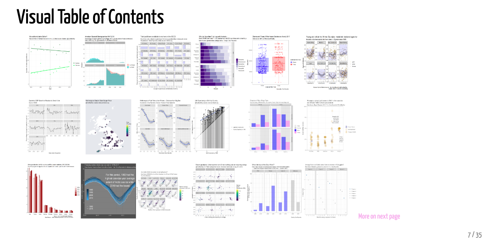

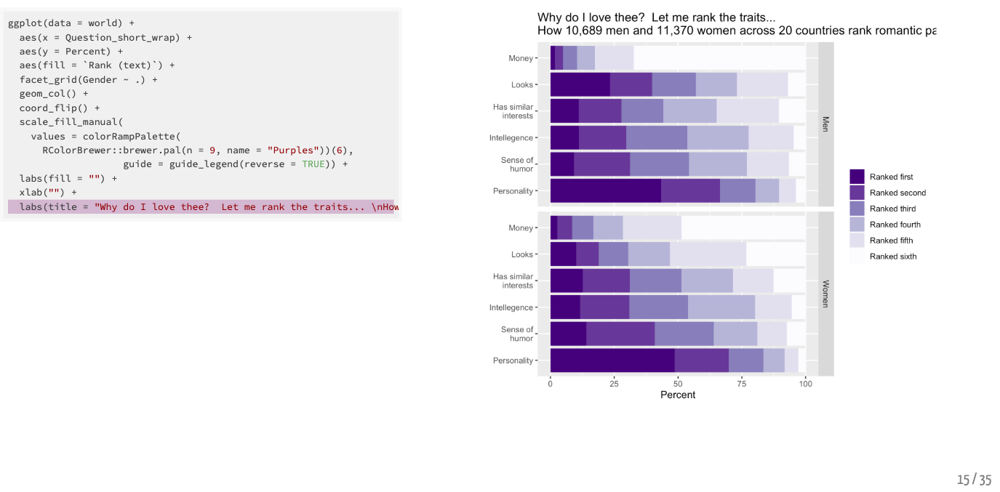

More favorites:

  - [Galton
    Board](https://evamaerey.github.io/little_flipbooks_library/galton_board/galton_board.html#1)
  - [leaflet for R (interactive
    maps)](https://evamaerey.github.io/little_flipbooks_library/leaflet/leaflet#1)
  - [ggplot
    themes](https://evamaerey.github.io/little_flipbooks_library/taming_themes_in_ggplot/taming_ggplot_themes.html)
  - [racing
    barchart](https://evamaerey.github.io/little_flipbooks_library/racing_bars/racing_barcharts.html)
  - [easing gallery for
    gganimate](https://evamaerey.github.io/easing_gganimate/easing_examples.html)
  - [D’Hondt/Jefferson
    Allocation](https://evamaerey.github.io/little_flipbooks_library/dhondt_jefferson_allocation/dhondt_jefferson_allocation)
  - [ggplot
    themes](https://evamaerey.github.io/little_flipbooks_library/taming_themes_in_ggplot/taming_ggplot_themes.html)
  - [a data.table
    flipbook](https://evamaerey.github.io/little_flipbooks_library/data.table/data.table)
  - [\#TidyTuesday walk
    through](https://evamaerey.github.io/tidytuesday_walk_through/tidytuesday_highlights.html)
