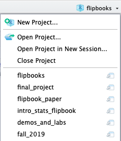
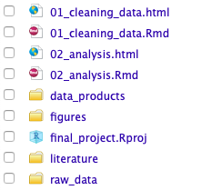
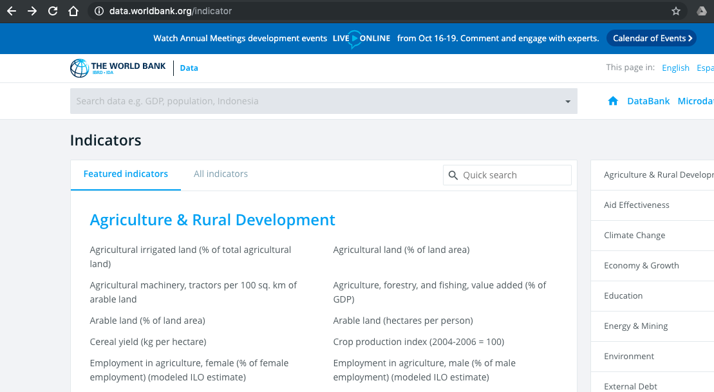
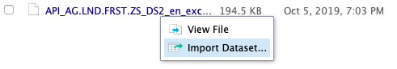
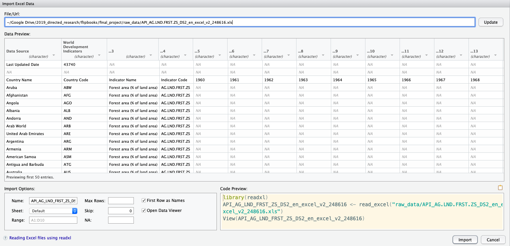
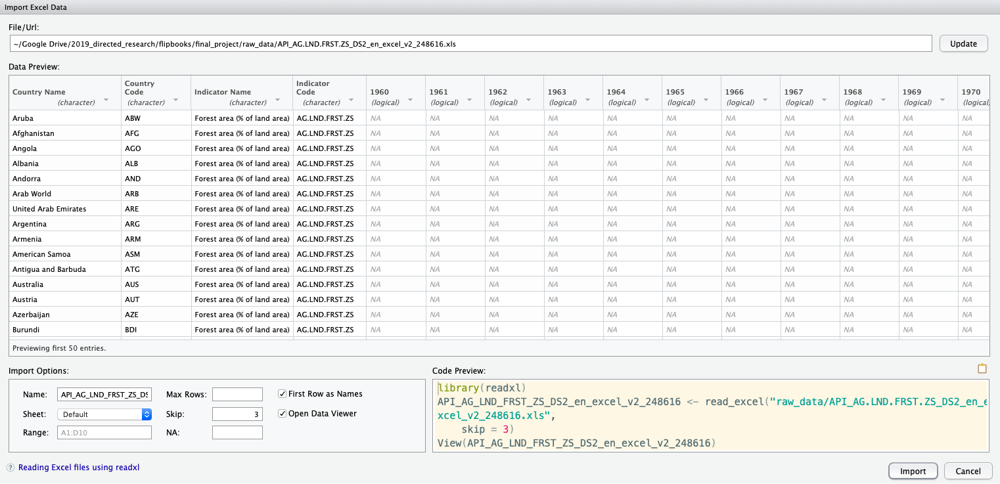
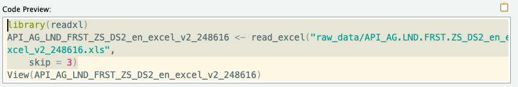

```{r setup, include=FALSE}
knitr::opts_chunk$set(echo = TRUE)
knitr::opts_chunk$set(fig.height = 6, out.width = "100%", comment = " ", cache = T, warning = F, message = F)

source("https://raw.githubusercontent.com/EvaMaeRey/little_flipbooks_library/master/xaringan_reveal_parentheses_balanced.R")
# options(tibble.print_max = 30) 
```


# Introduction

Data cleaning is the pits.  Or is it?  The cleaning tools of the `tidyverse` and other packages like `janitor` might help such tasks become less terrible -- and more of a delight! Let's look at a couple of examples. 


---

# Getting started with R and RStudio

The tools demonstrated in this book are implemented in the statistical software, R which is opensource and freely available.  RStudio, an integrated development environment (IDE), is a nice environment for working in R.  The following links may help you get R and RStudio up and running. 

- [Install Windows](https://www.youtube.com/watch?v=aCRMhAWmtpw)
- [Install Mac](https://www.youtube.com/watch?v=GLLZhc_5enQ)


---

# Acknowledgements

I'm grateful to the tidyverse team for their tireless work on developing and maintaining this wonderful toolkit and to RStudio for supporting the development.  Emi Tanaka (@statsgen) and Garrick Aden-Buie (@grrrck) helped by writing code to made the flipbook style possible. I'm *very* grateful to them for their work on this as well as to Yihui Xie and others for their work on the Xaringan package --- the extraordinary platform for creating the slides for this book.  I'm thankful too to my students who refresh my perspective on teaching and learning new tools.  Finally, thanks to David who is supportive of data cleaning and of me. 


---

# Preliminaries

This book covers some examples of getting data into R and cleaning it.  There are about 5 steps involved as follows:

- Step 0: Identifying data of interest
- Step 1: Saving this data to your raw_data folder
- Step 2: Scanning the data into R and assigning an object like *the_data_raw*
- Step 3: Cleaning the data and assigning to an object like *the_data*
- Step 4: Saving out the clean data in a data_products folder
- Step 5: Loading your clean data - ready for analysis! 

This workflow assumes that you are using a project structure.  So let's make sure that you have that set up.


---

# Open your project in RStudio

It's helpful to use RStudio projects. You should have a final_project created already.  In RStudio, you can navigate to it from the right hand corner icon.  In the example, here, I'm currently in a project called `flipbooks` but I need to navigate to the project in the list called `final_project`. You should navigate there too!




---

# Project structure



Steps 1-4 (maybe just 2-4) will happen in the 01_cleaning_data.Rmd, and Step 5 will happen in 02_analysis.Rmd.  

---

# Project structure

Another way to show this is with a directory tree as shown here:    

```
final_project
├── 01_data_cleaning.Rmd   <- work files
├── 02_analysis.Rmd        <- work files
├── final_project.Rproj    <- you declared your project
├── raw_data        <- Folder
├── data_products   <- Folder
├── figures         <- Folder
├── literature      <- Folder
```


---

# Example 1: Fisheries data from Wikipedia

This book will cover a few examples.  The first is about fisheries around the world.  A clean version of this data is used in a lab that we might do in the future about conflict over resources; the lab is adapted from a lab originally written by Angela Zoss and Eric Monson. 

---

## Step 0: find data!

The date for this first example comes from the second table on the Wikipedia page [Fishing Industry by Country](https://en.wikipedia.org/wiki/Fishing_industry_by_country).

```{r, echo = F}
knitr::include_url("https://en.wikipedia.org/wiki/Fishing_industry_by_country")
```

---

## Step 1: get data

The first step saving your file of interest  to your raw data folder.  You can do this manually or use *download.file()* with a web address, as we do here. 

```{r, eval = F}
download.file(url = "https://en.wikipedia.org/wiki/Fishing_industry_by_country", 
              destfile = "raw_data/wikipedia_fisheries.html")
```

---

## Step 2:  scan in data and create an object *like `fisheries_2015_raw`*


Once you have saved your raw data, you need to scan/read the data into R.  There are a variety of functions to do this depending on your data type.  In this example, we are wanting to read in a table embedded in an html file.  We can read in the data with the htmltab function from the htmltab package. 

---

```{r read_in_fisheries, eval = T, echo = F}
# using the htmltab package to scan html file
htmltab::htmltab(doc = "raw_data/wikipedia_fisheries.html",
                 # the second table object is what we want
                 which = 2) ->
# assign this to an object with the _raw suffix
fisheries_2015_raw
```


`r apply_reveal("read_in_fisheries")`


---

## Step 3:  Load tidyverse, Clean data and create an cleaned object *like fisheries_2015*

We'll do most of the manipulation with dplyr and tidyr which are subpackages of the tidyverse.

---

```{r clean_wikipedia_fisheries, eval = T, echo = F}
fisheries_2015_raw %>% 
  as_tibble() %>% # show data in "tidyverse" way, as_tibble
  # you may need to install the janitor package for this next step
  # if you have not already done so
  janitor::clean_names(case = "snake") %>% # snake is the default too 
  # converting columns to numeric 'dbl', which were character 'cha'
  mutate(capture = 
           readr::parse_number(x = capture)) %>% 
  mutate(aquaculture = 
           readr::parse_number(x = aquaculture)) %>% 
  mutate(total = 
           readr::parse_number(x = total)) %>%
  # removing white spaces before and after a string
  mutate(country = str_trim(string = country)) %>%
  # creating region variable 
  # using countrycode function from countrycode package
  # if you haven't done so, 
  mutate(region = 
           countrycode::countrycode(
             sourcevar = country,
             origin = "country.name",
             dest = "region")) %>% 
  # country codes are useful for merging data
  mutate(iso3c =   
           countrycode::countrycode(
             sourcevar = country,
             origin = "country.name",
             dest = "iso3c")) %>% 
  # one row is an aggregation - deleting this
  filter(country != "Total (2015)") ->
fisheries_2015
```

`r apply_reveal("clean_wikipedia_fisheries")`

---

## Step 4: Saving out clean data:

Now you can save out your work in your data_products folder as follows:

```{r}
save(fisheries_2015, file = "data_products/fisheries_2015.Rdata")
```

This will typically be the last step in your 01_data_cleaning.Rmd file.  

---

## Step 5: Time for Analysis!!! Yay!

The first code chunk in 02_analysis.Rmd should look like this.  This makes the tidyverse and the cleaned data available at the start of your analysis. 

```{r}
library(tidyverse) # for wrangling (dplyr and tidyr) and plotting (ggplot)
load("data_products/fisheries_2015.Rdata")
```

---

## Project overview

Now your'll have some files in raw_data and data_products folders: 

```r
final_project
├── 01_data_cleaning.Rmd   <- work files
├── 02_analysis.Rmd        <- work files
├── final_project.Rproj    <- you declared your project
└── raw_data        <- Folder
    └── wikipedia_fisheries.html  <- New! html file, containing table
├── data_products   <- Folder
│   └── fisheries_2015.Rdata      <- New! cleaned data
├── figures         <- Folder
├── literature      <- Folder
```


---

# Example 2: 

## Step 0: find data! 

You might be interested in % of land area in a country that is forest use.  This is an indicator available at worldbank.org.

```{r, out.width="90%", echo = F}

```

---

## Step 1: get data


This time, I just downloaded the data from the website, saving it to my *raw_data* folder.


---

## Step 2: scan in the data and create `wb_percent_forest_raw`


### Step 2a: Use RStudio importer tool

Navigate to your raw_data folder in the "files" pane. Then click on data and then choose "Import Dataset"



---

### Step 2b: Make adjustments if needed

This is what I see initially. 

```{r, out.width="90%", echo = F}

```

---

### Step 2b: Make adjustments if needed

There is 'meta data' in the first three rows.  The dataset doesn't really get start until row 4.  Therefore, in the **import options** section, I'll adjust the option for **Skip** to *3*.  I then click **update** in the righthand corner.  

```{r, out.width="90%", echo = F}

```

---

### Step 2c: Copy everything **except** View() code from **Code Preview**

Copy everything *but* View() code from **Code Preview** and paste this into a code chunk in the file `01_data_cleaning.Rmd`.



---

### Step 2c: Change default name


You'll paste code that looks like this: 

```r
library(readxl)
API_AG_LND_FRST_ZS_DS2_en_excel_v2_248616 <- read_excel("raw_data/API_AG.LND.FRST.ZS_DS2_en_excel_v2_248616.xls", 
    skip = 3)
```

But this is a bit of a long object name that is automatically generated, so you might modify this to something simpler, with the '_raw' suffix.   

```{r}
library(readxl)
wb_percent_forest_raw <- read_excel("raw_data/API_AG.LND.FRST.ZS_DS2_en_excel_v2_248616.xls", 
    skip = 3)
```

Execute the code!

---

## Step 3: Load tidyverse and clean the data

Now, starting with the object you created by scanning in the data and assigning it to the object `wb_percent_forest_raw`, you are ready to perform cleaning steps.

---

```{r wb_cleaning, eval = T, echo = F}
wb_percent_forest_raw %>% 
  # change names to snake case
  janitor::clean_names() %>% 
  # get rid of columns that are not variables
  # indicator name and indicator code
  select(-indicator_name, -indicator_code) %>% 
  # suppose you are interested only in 2000 to 2005
  select(country_name, country_code, x2000:x2005) %>% 
  # data is "wide", but to use for analysis
  # we transform it to "long"
  gather(key = "year", 
         value = "percent_forest",
         x2000:x2005) %>% 
  mutate(year = str_remove(year, "x")) %>% 
  mutate(year = as.numeric(year)) %>% 
  # reordering data if you like
  arrange(-percent_forest) %>%
  # rename variable
  rename(wb_country_code = country_code) %>% 
  mutate(continent = 
           countrycode::countrycode(
             sourcevar = wb_country_code,
             origin = "wb",
             destination = "continent"
           )) ->
wb_percent_forest
```


`r apply_reveal("wb_cleaning")`

---

## Step 4: Save Clean Data

```{r}
save(wb_percent_forest, file = "data_products/wb_percent_forest.Rdata")
```


---

## Step 5: Time for Analysis! 

The first code chunk in 02_analysis.Rmd should look like this.  This makes the tidyverse and the cleaned data available at the start of your analysis. 

```{r}
library(tidyverse)
load(file = "data_products/wb_percent_forest.Rdata")
```


---

# Deeper Dives: country codes, dates, string manipulation

The examples above should give you some intuition for the look and feel of some real data cleaning pipelines.  But they of course are not very comprehensive. In this section, let's focus manipulation using a few packages. 

- countrycode - translates between one name or id for a country to another
- lubridate - working with dates
- stringr - character manipulation


---

## Country Code

Countries can have many names.  Consider the United States.  You can call it the US, the USA, the United States of America and so on.  The package countrycode can be helpful in translating between different ways to refer to a specific country. Let's see how you might use it. 


---

```{r countrycode, eval = F, echo = F}
library(gapminder)
library(countrycode)
gapminder %>% 
  distinct(country) %>% 
  mutate(iso3c = countrycode(
    sourcevar = country,
    origin = "country.name",
    destination = "iso3c"
           )) %>% 
  mutate(cowc = countrycode(
    s = country,
    origin = "country.name",
    d = "cowc")
    ) %>% 
  mutate(cown = countrycode(
    s = cowc,
    origin = "cowc",
    d = "cown")
    ) %>% 
  mutate(eu28 = countrycode(
    s = country,
    origin = "country.name",
    d = "eu28")
    ) %>% 
  mutate(eu28 = ifelse(
    is.na(eu28), "Not EU", "EU")
    )
```

`r apply_reveal("countrycode")`

---

## Lubridate

Dates are a special class of data, and there are many ways to express dates.  Let's have a look at how to use the lubridate package to "move around" between dates. We'll look at a very small dataset of four US holidays. 

```{r, echo = F}
tribble(
~date,	~holiday,
"January 1",	"New Year's Day",
"January 21",	"Martin Luther King Day",
"January 24",	"Belly Laugh Day",
"February 2",	"Groundhog Day"
) ->
holidays_2019
```

```{r}
holidays_2019
```


---

```{r lubridate, eval = F, echo = F}
library(lubridate)
holidays_2019 %>% 
  mutate(date = paste0(date, ", 2019")) %>% 
  mutate(date = mdy(date)) %>% 
  mutate(day = day(date)) %>% 
  mutate(month = month(date)) %>% 
  mutate(year = year(date)) %>% 
  mutate(day_of_week = weekdays(date)) %>%
  # making space for more manipulation
  select(-holiday, -day_of_week) %>% 
  mutate(euro_ordering = paste(day, month, year, sep = "/")) %>% 
  mutate(date_0 = dmy(euro_ordering)) %>% 
  mutate(since_jan_1 = date - ymd("2019-01-01")) 
```

`r apply_reveal("lubridate")`


---

## String (character) manipulation 

Character manipulation is also referred to as "regular expressions", or "Regex".  The package stringr seeks to provide a unified framework for string manipulation. Let's get a taste, using the holidays_2019 dataset again.  (The section is not particularly inspired - sorry!)

---


```{r stringr, eval = F, echo = F}
library(stringr)
holidays_2019 %>% 
  mutate(var_1 = 
           str_detect(holiday, "u")) %>% 
  mutate(var_1 = 
           tolower(holiday)) %>% 
  mutate(var_1 = 
           str_replace(holiday, "u", "REPLACED")) %>% 
  mutate(var_1 = 
           str_replace(holiday, "^.", "REPLACED")) %>% 
  mutate(var_1 = 
           str_replace(holiday, ".$", "REPLACED")) %>% 
  mutate(var_1 = 
           str_count(holiday, "a")) %>% 
  mutate(var_1 = 
           str_extract(holiday, ".....Day")) %>% 
  mutate(var_1 = 
           str_extract(holiday, "[[:PUNCT:]]"))
```


`r apply_reveal("stringr")`


---

# Key packages used

Sam Firke (2019). janitor: Simple Tools for Examining and
  Cleaning Dirty Data. R package version 1.2.0.
  https://CRAN.R-project.org/package=janitor

Hadley Wickham (2017). tidyverse: Easily Install and Load
  the 'Tidyverse'. R package version 1.2.1.
  https://CRAN.R-project.org/package=tidyverse

Arel-Bundock et al., (2018). countrycode: An R package to
  convert country names and country codes. Journal of Open
  Source Software, 3(28), 848,
  https://doi.org/10.21105/joss.00848

Christian Rubba (2016). htmltab: Assemble Data Frames from
  HTML Tables. R package version 0.7.1.
  https://CRAN.R-project.org/package=htmltab

---

I get the UN Security Council data from the UN's website "Countries Elected Members of the Security Council".

```{r, eval = F, echo = F}
url = "https://www.un.org/securitycouncil/content/countries-elected-members"
download.file(url = url, "raw_data/unsc_countries_elected_members.html")
```


```{r, eval = F, echo = F}
readLines(con = "raw_data/unsc_countries_elected_members.html", encoding = "windows-1252") ->
unsc_members_raw
```


---

```{r unsc_membership_clean, eval = F, echo = F}
library(tidyverse)
tibble(text = unsc_members_raw) %>%
  mutate(tenure = 
           str_detect(text, "^\\d")) %>%
  mutate(country = ifelse(!tenure, text, NA)) %>%
  fill(country) %>%
  filter(tenure) %>%
  mutate(tenure = str_split(text, ",")) %>%
  unnest() %>%
  mutate(country = str_trim(country)) %>%
  mutate(tenure = str_trim(tenure)) %>%
  select(-text) %>%
  separate(tenure, c("first_year_tenure", "second_year_tenure")) %>%
  mutate(first_year_tenure = as.numeric(first_year_tenure)) %>%
  mutate(second_year_tenure = as.numeric(second_year_tenure)) %>%
  arrange(country, first_year_tenure) %>%
  filter(country != "Saudi Arabia") %>%
  bind_rows(data_frame(country = "East Germany", first_year_tenure = 1980, second_year_tenure = 1981, which_tenure = 1)) %>%  # East German case was missing
  mutate(country = countrycode::countrycode(sourcevar = country, origin = "country.name", destination = "country.name")) %>%
  group_by(country) %>%
  mutate(which_tenure = 1:n()) %>%
  ungroup() %>%
  gather(key = "which_tenure_year", value = "year", first_year_tenure:second_year_tenure) %>%
  filter(!is.na(year))
```


---

---

```{r eval = F}
citation("lubridate")
```

Sam Firke (2019). janitor: Simple Tools for Examining and
  Cleaning Dirty Data. R package version 1.2.0.
  https://CRAN.R-project.org/package=janitor

Hadley Wickham (2017). tidyverse: Easily Install and Load
  the 'Tidyverse'. R package version 1.2.1.
  https://CRAN.R-project.org/package=tidyverse

Arel-Bundock et al., (2018). countrycode: An R package to
  convert country names and country codes. Journal of Open
  Source Software, 3(28), 848,
  https://doi.org/10.21105/joss.00848

Christian Rubba (2016). htmltab: Assemble Data Frames from
  HTML Tables. R package version 0.7.1.
  https://CRAN.R-project.org/package=htmltab

Garrett Grolemund, Hadley Wickham (2011). Dates
  and Times Made Easy with lubridate. Journal of
  Statistical Software, 40(3), 1-25. URL
  http://www.jstatsoft.org/v40/i03/.

---


```{css, eval = TRUE, echo = F}
.remark-code{line-height: 1.5; font-size: 65%}
```


