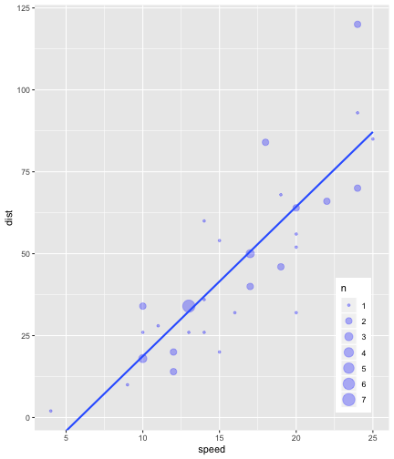
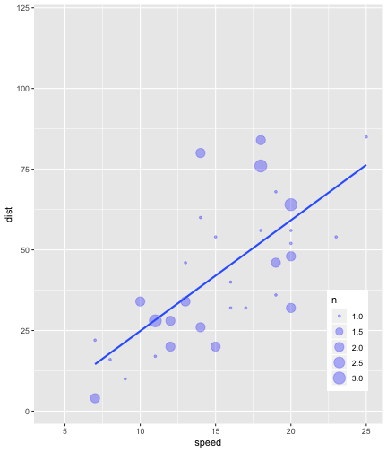
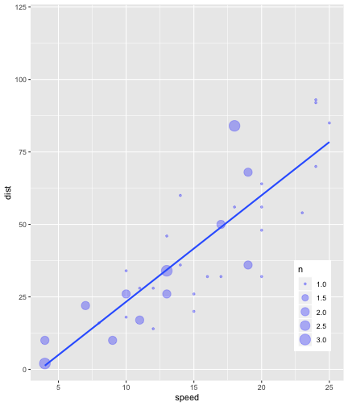
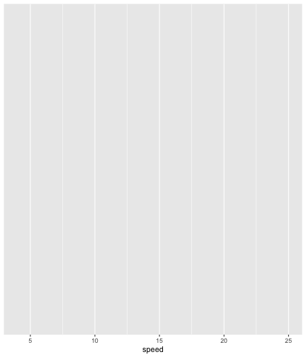
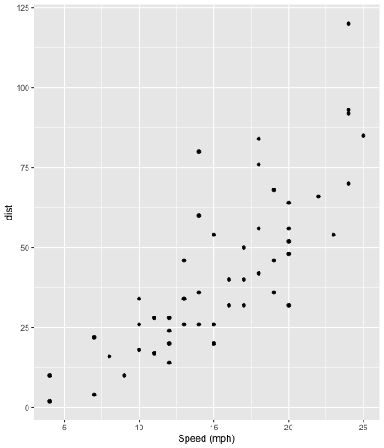
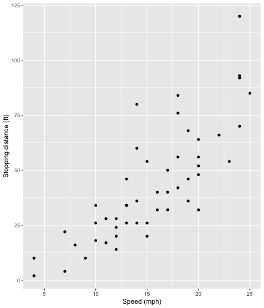
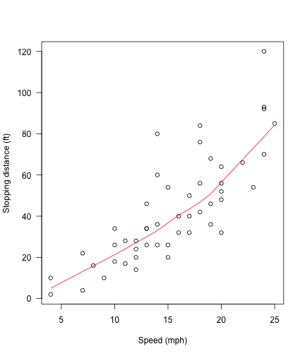
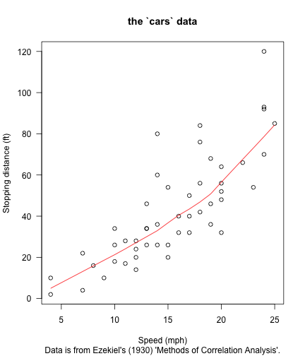
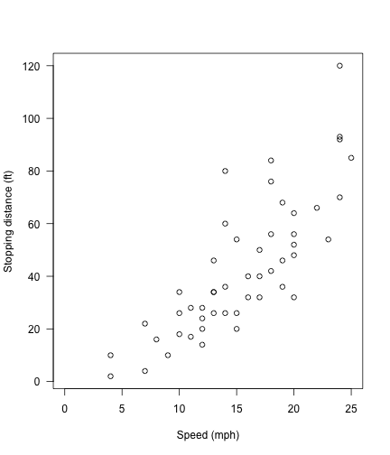
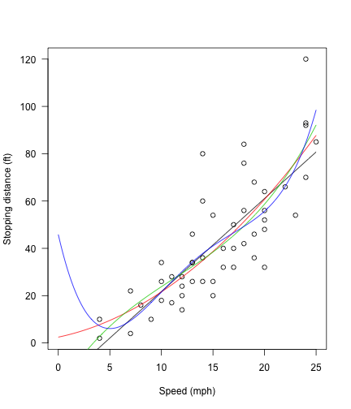

# Welcome

- Yes, there is now a package called `flipbookr`

--

- Yes, it's still under construction (thus, the dramatic "fragile" and "perilous")

--

- Yes, you can help make it less fragile and perilous by contributing at https://github.com/EvaMaeRey/flipbookr and letting us know if/how it breaks and frustrates you!  

--

- Then we'll retitle this book!


---

# "Flipbooks" you say? 

“Flipbooks” are tools that present side-by-side, aligned, incremental code-output evolution via automated code parsing and reconstruction. More about Flipbooks [here](https://evamaerey.github.io/little_flipbooks_library/about/what_the_flipbook).  There now exists a package for making Flipbooks for R: `flipbookr`.  This is under development, but you are welcome to try it out by installing from github:

``` r
devtools::install_github("EvaMaeRey/flipbookr")
```

You can see the template that was used to build this flipbook that you are looking at right now  [here](https://raw.githubusercontent.com/EvaMaeRey/flipbookr/master/inst/rmarkdown/templates/template-name/skeleton/skeleton.Rmd).


And once you install the package, a template for making the flipbook that you are looking at will also be available from within RStudio, File -> New File -> R Markdown -> From Template -> "A Minimal Flipbook".


---

# Critical infrastructure

The flipbook you will be building here uses the [rmarkdown](https://rmarkdown.rstudio.com/lesson-1.html) and [Xaringan](https://github.com/yihui/xaringan) (html slideshow) infrastructure.  

Dynamic documents like `rmarkdown` documents allow you to comingle code and prose in a single document.  Flipbooks walk through code by spawning new *partial* code chunks from a single, user-input code chunk.  The partial code chunks build up and are displayed consecutively in a slide show --- along side it's output --- which yeilds a movie-like experience, and allows for easier understanding of each step.

---

We use the flipbookr package, of course! This does the work of disassembling a single code chuck and creating the "build" of multiple partial-code chunks.  


```r
library(flipbookr)
```

Also, I set *code chunk* options for the code chunks that follow.  These will apply to the spawned code chunks.


```r
knitr::opts_chunk$set(fig.width = 6, message = F, warning = F, comment = "", cache = T)
```


<!-- So that I can sometimes work interactively on the package, I still am making the source script available for myself.-->


---

## Change slide show look and feel

To quickly change the look and feel of your xaringan slide show, I'd recommend that you use the [xaringanthemer](https://github.com/gadenbuie/xaringanthemer) package.  The code below creates a css file for you that will be used to style your slide show; you can see it referenced at the beginning of this document in the "YMAL" --- the introductory materials that you see at the top of this document.   


```r
xaringanthemer::mono_accent(
  code_highlight_color = "rgba(255, 211, 0, .35)",
  base_color = "#03418A")
```

```
[1] "xaringan-themer.css"
```

It may be obvious by now, if you are following along with the source template, that slide breaks are indicated with `---` (be careful trailing white space is not allowed). 


---

# Using `flipbookr::reveal()`

You will use the `reveal()` function [inline](https://rmarkdown.rstudio.com/lesson-4.html) to generate the derivitive code chunks, rather than inside of a code chunk, so that the text that is generated is interpreted correctly when rendered.  The inline code will look something like this:

```markdown
`r flipbookr::reveal(chunk_name = "cars")`
``` 

<!-- The above is for the rendered version, Just look at the examples below if you are in the source! -->

There are several modalities that you might be interested in using for "flipbookifying" your code and the next section is dedicated to demoing some of them below.


- **break type** -- *which lines of code should be revealed when*, `break_type` defaults to "auto"
- **display type** -- *display code and output, or just output, or just code?*, `display_type` defaults to "both"
- **assignment type** -- *does code chunk use regular assignment?*, `reg_assign` defaults to FALSE


---

At first we'll apply our flipbooking to the below input code - the code chunk is named "cars".  For now I set echo = TRUE for this code chunk, so you can see the code content but sometimes you might like to set echo to FALSE. This code uses tidyverse tools, so we'll load that too in a previous code chunk. 


```r
library(tidyverse)
```


```r
cars %>%             # the data 
  filter(speed > 4) %>%  # subset
  ggplot() +              # pipe to ggplot
  aes(x = speed) +
  aes(y = dist) + #REVEAL
  # Describing what follows
  geom_point(
    alpha = .3, #REVEAL2
    color = "blue" #REVEAL3
    ) + #REVEAL
  aes(size = speed) #REVEAL
```

---

# `break_type`


Notice the regular comments and the special #REVEAL comments, these will be used for a couple of the different "break type" modalities.


```r
cars %>%             # the data 
  filter(speed > 4) %>%  # subset
  ggplot() +              # pipe to ggplot
  aes(x = speed) +
  aes(y = dist) + #REVEAL
  # Describing what follows
  geom_point(
    alpha = .3, #REVEAL2
    color = "blue" #REVEAL3
    ) + #REVEAL
  aes(size = speed) #REVEAL
```

<!-- Also notice how we've created a new code chunk with the code from the previous chunk. -->
<!-- This slide is also about giving you some intuition about how flipbooking works in the background. -->
<!-- (more on this [here](https://emitanaka.rbind.io/post/knitr-knitr-code/)) -->


---

## break_type = "auto"

One parameter of flipbooking is the break_type.  The default is "auto", in which appropriate breakpoints are determined automatically --- by finding where parentheses are balanced. 

---

class: split-40
count: false

.column[.content[

```r
cars   # the data#<<
```
]]
.column[.content[

]]
---
class: split-40
count: false

.column[.content[

```r
cars %>%  # the data
  filter(speed > 4)   # subset#<<
```
]]
.column[.content[

]]
---
class: split-40
count: false

.column[.content[

```r
cars %>%  # the data
  filter(speed > 4) %>%  # subset
  ggplot()   # pipe to ggplot#<<
```
]]
.column[.content[

]]
---
class: split-40
count: false

.column[.content[

```r
cars %>%  # the data
  filter(speed > 4) %>%  # subset
  ggplot() +  # pipe to ggplot
  aes(x = speed)   #<<
```
]]
.column[.content[

]]
---
class: split-40
count: false

.column[.content[

```r
cars %>%  # the data
  filter(speed > 4) %>%  # subset
  ggplot() +  # pipe to ggplot
  aes(x = speed) +  
  aes(y = dist)   #<<
```
]]
.column[.content[

]]
---
class: split-40
count: false

.column[.content[

```r
cars %>%  # the data
  filter(speed > 4) %>%  # subset
  ggplot() +  # pipe to ggplot
  aes(x = speed) +  
  aes(y = dist) +  
  # Describing what follows#<<
  geom_point(  #<<
    alpha = .3,  #<<
    color = "blue"  #<<
    )   #<<
```
]]
.column[.content[

]]
---
class: split-40
count: false

.column[.content[

```r
cars %>%  # the data
  filter(speed > 4) %>%  # subset
  ggplot() +  # pipe to ggplot
  aes(x = speed) +  
  aes(y = dist) +  
  # Describing what follows
  geom_point(  
    alpha = .3,  
    color = "blue"  
    ) +  
  aes(size = speed)  #<<
```
]]
.column[.content[

]]

---

## break_type = "user"

If the break_type is set to "user", the breakpoints are those indicated by the user with the special comment #REVEAL

---

class: split-40
count: false

.column[.content[

```r
cars %>%  # the data#<<
  filter(speed > 4) %>%  # subset#<<
  ggplot() +  # pipe to ggplot#<<
  aes(x = speed) +  #<<
  aes(y = dist)   #<<
```
]]
.column[.content[

]]
---
class: split-40
count: false

.column[.content[

```r
cars %>%  # the data
  filter(speed > 4) %>%  # subset
  ggplot() +  # pipe to ggplot
  aes(x = speed) +  
  aes(y = dist) +  
  # Describing what follows#<<
  geom_point(  #<<
    alpha = .3,  #<<
    color = "blue"  #<<
    )   #<<
```
]]
.column[.content[

]]
---
class: split-40
count: false

.column[.content[

```r
cars %>%  # the data
  filter(speed > 4) %>%  # subset
  ggplot() +  # pipe to ggplot
  aes(x = speed) +  
  aes(y = dist) +  
  # Describing what follows
  geom_point(  
    alpha = .3,  
    color = "blue"  
    ) +  
  aes(size = speed)  #<<
```
]]
.column[.content[

]]

---

## break_type = "non_seq"

If the break_type is set to "non_seq", the breakpoints are those indicated by the user with the special numeric comment #REVEAL2, #REVEAL3 etc to indicate at which point in time the code should appear.  

---

class: split-40
count: false

.column[.content[

```r
cars %>%  # the data
  filter(speed > 4) %>%  # subset
  ggplot() +  # pipe to ggplot
  aes(x = speed) +  
  aes(y = dist) +  
  # Describing what follows
  geom_point(  
    ) +  
  aes(size = speed)  
```
]]
.column[.content[

]]
---
class: split-40
count: false

.column[.content[

```r
cars %>%  # the data
  filter(speed > 4) %>%  # subset
  ggplot() +  # pipe to ggplot
  aes(x = speed) +  
  aes(y = dist) +  
  # Describing what follows
  geom_point(  
    alpha = .3,  #<<
    ) +  
  aes(size = speed)  
```
]]
.column[.content[

]]
---
class: split-40
count: false

.column[.content[

```r
cars %>%  # the data
  filter(speed > 4) %>%  # subset
  ggplot() +  # pipe to ggplot
  aes(x = speed) +  
  aes(y = dist) +  
  # Describing what follows
  geom_point(  
    alpha = .3,  
    color = "blue"  #<<
    ) +  
  aes(size = speed)  
```
]]
.column[.content[

]]


---

## `break_type = 5` *(or entering the multiverse)*

Another modality is to set break_type equal to a positive integer, indicating that you want the same code chunk to be displayed multiple times.  This makes the most sense in a setting where there is some randomization or random sampling and you want to see different realizations. 

---

class: split-40
count: false

.column[.content[

```r
cars %>%  
  sample_frac(size = 1, replace = T) %>%  
  ggplot() +  # pipe to ggplot
  aes(x = speed) +  
  aes(y = dist) +  
  # Describing what follows
  geom_count(  
    alpha = .3,  
    color = "blue"  
    ) +  
  geom_smooth(method = lm, se = F) +  
  coord_cartesian(xlim = range(cars$speed),  
                  ylim = range(cars$dist)) +  
  theme(legend.position = c(.9, .2))  
```
]]
.column[.content[

]]
---
class: split-40
count: false

.column[.content[

```r
cars %>%  
  sample_frac(size = 1, replace = T) %>%  
  ggplot() +  # pipe to ggplot
  aes(x = speed) +  
  aes(y = dist) +  
  # Describing what follows
  geom_count(  
    alpha = .3,  
    color = "blue"  
    ) +  
  geom_smooth(method = lm, se = F) +  
  coord_cartesian(xlim = range(cars$speed),  
                  ylim = range(cars$dist)) +  
  theme(legend.position = c(.9, .2))  
```
]]
.column[.content[

]]
---
class: split-40
count: false

.column[.content[

```r
cars %>%  
  sample_frac(size = 1, replace = T) %>%  
  ggplot() +  # pipe to ggplot
  aes(x = speed) +  
  aes(y = dist) +  
  # Describing what follows
  geom_count(  
    alpha = .3,  
    color = "blue"  
    ) +  
  geom_smooth(method = lm, se = F) +  
  coord_cartesian(xlim = range(cars$speed),  
                  ylim = range(cars$dist)) +  
  theme(legend.position = c(.9, .2))  
```
]]
.column[.content[

]]


---

# `display_type`

There are also different display modalities.  Namely you can indicate if you want "both" the code and the output displayed in your flipbookification, or just the "output" (perhaps to be used in a traditional presentation), or just the "code" (which might be used to kind of test student expectations about some code).  You have already seen the default where the parameter display_type is set to "both", but let's have a look at "output" and "code" only.


---

## `display_type = "output"`


---

count: false


---
count: false


---
count: false


---

## `display_type = "code"`

---

count: false


```r
cars   # the data#<<
```
---
count: false


```r
cars %>%  # the data
  filter(speed > 4)   # subset#<<
```
---
count: false


```r
cars %>%  # the data
  filter(speed > 4) %>%  # subset
  ggplot()   # pipe to ggplot#<<
```
---
count: false


```r
cars %>%  # the data
  filter(speed > 4) %>%  # subset
  ggplot() +  # pipe to ggplot
  aes(x = speed)   #<<
```
---
count: false


```r
cars %>%  # the data
  filter(speed > 4) %>%  # subset
  ggplot() +  # pipe to ggplot
  aes(x = speed) +  
  aes(y = dist)   #<<
```
---
count: false


```r
cars %>%  # the data
  filter(speed > 4) %>%  # subset
  ggplot() +  # pipe to ggplot
  aes(x = speed) +  
  aes(y = dist) +  
  # Describing what follows#<<
  geom_point(  #<<
    alpha = .3,  #<<
    color = "blue"  #<<
    )   #<<
```
---
count: false


```r
cars %>%  # the data
  filter(speed > 4) %>%  # subset
  ggplot() +  # pipe to ggplot
  aes(x = speed) +  
  aes(y = dist) +  
  # Describing what follows
  geom_point(  
    alpha = .3,  
    color = "blue"  
    ) +  
  aes(size = speed)  #<<
```


---

# `reg_assign`


---


# `reg_assign = TRUE`

flipbooking works most naturally with chains of manipualtions which might include *reverse assignment*.  Working sequentially with a pipeline of code, you get feedback all along the way until you get to the point of assigning all of what you have done to a new object.  With assignment in R, you don't get any feedback, so flipbooking prefers this step at the end of a pipeline, so we can enjoy all the nice feedback. So the parameter reg_assign is by default set to FALSE.

But, setting the reg_assign paramter to T and using regular assignment, you can still create a meaningful flipbook that gives you feedback.   When reg_assign = T, the first object that is created prints at the end of the derivative code chunks. 


---

class: split-40
count: false

.column[.content[

```r
my_plot <- cars   # the data#<<
 
my_plot # print object
```
]]
.column[.content[

```
Error in gzfile(file, "wb"): cannot open the connection
```
]]
---
class: split-40
count: false

.column[.content[

```r
my_plot <- cars %>%  # the data
  filter(speed > 4)   # subset#<<
 
my_plot # print object
```
]]
.column[.content[

```
Error in gzfile(file, "wb"): cannot open the connection
```
]]
---
class: split-40
count: false

.column[.content[

```r
my_plot <- cars %>%  # the data
  filter(speed > 4) %>%  # subset
  ggplot()   # pipe to ggplot#<<
 
my_plot # print object
```
]]
.column[.content[

]]
---
class: split-40
count: false

.column[.content[

```r
my_plot <- cars %>%  # the data
  filter(speed > 4) %>%  # subset
  ggplot() +  # pipe to ggplot
  aes(x = speed)   #<<
 
my_plot # print object
```
]]
.column[.content[

]]
---
class: split-40
count: false

.column[.content[

```r
my_plot <- cars %>%  # the data
  filter(speed > 4) %>%  # subset
  ggplot() +  # pipe to ggplot
  aes(x = speed) +  
  aes(y = dist)   #<<
 
my_plot # print object
```
]]
.column[.content[

]]
---
class: split-40
count: false

.column[.content[

```r
my_plot <- cars %>%  # the data
  filter(speed > 4) %>%  # subset
  ggplot() +  # pipe to ggplot
  aes(x = speed) +  
  aes(y = dist) +  
  geom_point()  #<<
 
my_plot # print object
```
]]
.column[.content[

]]


---

# Managing source code chunks

So, it is pretty cool that we can create a bunch of derivative code chunks from one input code chunk (more on this [here](https://emitanaka.rbind.io/post/knitr-knitr-code/)).  But there are some considerations then for this source chunk.  What should its chunk options be? 

If there are dependenceies between code chunks, you may need to turn the code chunk option `eval` to TRUE (and usually echo = F).  This may be the case when you create an object in one code chunk that you use in a subsequent code chunk.  

---

class: split-40
count: false

.column[.content[

```r
cars   #<<
```
]]
.column[.content[

```
Error in gzfile(file, "wb"): cannot open the connection
```
]]
---
class: split-40
count: false

.column[.content[

```r
cars %>%  
  ggplot()   #<<
```
]]
.column[.content[

]]
---
class: split-40
count: false

.column[.content[

```r
cars %>%  
  ggplot() +  
  aes(x = speed)   #<<
```
]]
.column[.content[

]]
---
class: split-40
count: false

.column[.content[

```r
cars %>%  
  ggplot() +  
  aes(x = speed) +  
  aes(y = dist)   #<<
```
]]
.column[.content[

]]
---
class: split-40
count: false

.column[.content[

```r
cars %>%  
  ggplot() +  
  aes(x = speed) +  
  aes(y = dist) +  
  geom_point()   #<<
```
]]
.column[.content[

]]
---
class: split-40
count: false

.column[.content[

```r
cars %>%  
  ggplot() +  
  aes(x = speed) +  
  aes(y = dist) +  
  geom_point() ->  
cars_plot  #<<
```
]]
.column[.content[

]]


---


class: split-40
count: false

.column[.content[

```r
cars_plot   #<<
```
]]
.column[.content[

]]
---
class: split-40
count: false

.column[.content[

```r
cars_plot +  
  labs(x = "Speed (mph)")   #<<
```
]]
.column[.content[

]]
---
class: split-40
count: false

.column[.content[

```r
cars_plot +  
  labs(x = "Speed (mph)") +  
  labs(y = "Stopping distance (ft)")  #<<
```
]]
.column[.content[

]]


---

# Beyond the tidyverse

It is no surprise that Flipbooks are born in the context of the popularity of the tidyverse tools --- tools that are designed be be used in sequential pipelines and that give a satisfying amount of feedback along the way!

But base R techniques and other popular tools can certainly also be employed.  

---

# "chaining" by overwriting objects

---

class: split-40
count: false

.column[.content[

```r
cars_mod <- cars  #<<
 
cars_mod # print object
```
]]
.column[.content[

```
Error in gzfile(file, "wb"): cannot open the connection
```
]]
---
class: split-40
count: false

.column[.content[

```r
cars_mod <- cars  
names(cars_mod)[2] <- "distance"  #<<
 
cars_mod # print object
```
]]
.column[.content[

```
Error in gzfile(file, "wb"): cannot open the connection
```
]]
---
class: split-40
count: false

.column[.content[

```r
cars_mod <- cars  
names(cars_mod)[2] <- "distance"  
cars_mod <- cars_mod[cars_mod$distance > 10,]  #<<
 
cars_mod # print object
```
]]
.column[.content[

```
Error in gzfile(file, "wb"): cannot open the connection
```
]]
---
class: split-40
count: false

.column[.content[

```r
cars_mod <- cars  
names(cars_mod)[2] <- "distance"  
cars_mod <- cars_mod[cars_mod$distance > 10,]  
cars_mod <- cars_mod["distance"]  #<<
 
cars_mod # print object
```
]]
.column[.content[

```
Error in gzfile(file, "wb"): cannot open the connection
```
]]


---

## using the .[] and .[[]] syntax with the migrittr pipe - %>%

Flipbooking can also be applied to logical indexing workflows if the steps are broken up using the %>% followed by .[] and .[[]].  Thus flipbooking can also be used with base R logical indexing and with the popular `data.table` package. 


---

class: split-40
count: false

.column[.content[

```r
cars   #<<
```
]]
.column[.content[

```
Error in gzfile(file, "wb"): cannot open the connection
```
]]
---
class: split-40
count: false

.column[.content[

```r
cars %>%  
  .[cars$speed > median(cars$speed),]   #<<
```
]]
.column[.content[

```
Error in gzfile(file, "wb"): cannot open the connection
```
]]
---
class: split-40
count: false

.column[.content[

```r
cars %>%  
  .[cars$speed > median(cars$speed),] %>%  
  .["speed"]   #<<
```
]]
.column[.content[

```
Error in gzfile(file, "wb"): cannot open the connection
```
]]
---
class: split-40
count: false

.column[.content[

```r
cars %>%  
  .[cars$speed > median(cars$speed),] %>%  
  .["speed"] %>%  
  .[,1]   #<<
```
]]
.column[.content[

```
 [1] 16 16 17 17 17 18 18 18 18 19 19 19 20 20 20 20 20 22 23 24 24 24 24 25
```
]]
---
class: split-40
count: false

.column[.content[

```r
cars %>%  
  .[cars$speed > median(cars$speed),] %>%  
  .["speed"] %>%  
  .[,1] ->  
top_speeds  #<<
```
]]
.column[.content[

]]


---


# Base R plotting

It has been a while since I've done much plotting with base R, but I think it is important to have an example or two. 

---

class: split-40
count: false

.column[.content[

```r
plot(cars, xlab = "Speed (mph)",  #<<
     ylab = "Stopping distance (ft)",  #<<
     las = 1)  #<<
```
]]
.column[.content[

]]
---
class: split-40
count: false

.column[.content[

```r
plot(cars, xlab = "Speed (mph)",  
     ylab = "Stopping distance (ft)",  
     las = 1)  
lines(lowess(cars$speed, cars$dist,  #<<
             f = 2/3, iter = 3),  #<<
      col = "red")  #<<
```
]]
.column[.content[

]]
---
class: split-40
count: false

.column[.content[

```r
plot(cars, xlab = "Speed (mph)",  
     ylab = "Stopping distance (ft)",  
     las = 1)  
lines(lowess(cars$speed, cars$dist,  
             f = 2/3, iter = 3),  
      col = "red")  
title(main = "the `cars` data")  #<<
```
]]
.column[.content[

]]
---
class: split-40
count: false

.column[.content[

```r
plot(cars, xlab = "Speed (mph)",  
     ylab = "Stopping distance (ft)",  
     las = 1)  
lines(lowess(cars$speed, cars$dist,  
             f = 2/3, iter = 3),  
      col = "red")  
title(main = "the `cars` data")  
title(sub = "Data is from Ezekiel's (1930) 'Methods of Correlation Analysis'.")  #<<
```
]]
.column[.content[

]]


---

class: split-40
count: false

.column[.content[

```r
  ## An example of polynomial regression#<<
plot(cars, xlab = "Speed (mph)",  #<<
     ylab = "Stopping distance (ft)",  #<<
    las = 1, xlim = c(0, 25))  #<<
```
]]
.column[.content[

]]
---
class: split-40
count: false

.column[.content[

```r
  ## An example of polynomial regression
plot(cars, xlab = "Speed (mph)",  
     ylab = "Stopping distance (ft)",  
    las = 1, xlim = c(0, 25))  
seq(0, 25, length.out = 200)   #<<
```
]]
.column[.content[


```
  [1]  0.0000000  0.1256281  0.2512563  0.3768844  0.5025126  0.6281407  0.7537688  0.8793970  1.0050251  1.1306533  1.2562814  1.3819095
 [13]  1.5075377  1.6331658  1.7587940  1.8844221  2.0100503  2.1356784  2.2613065  2.3869347  2.5125628  2.6381910  2.7638191  2.8894472
 [25]  3.0150754  3.1407035  3.2663317  3.3919598  3.5175879  3.6432161  3.7688442  3.8944724  4.0201005  4.1457286  4.2713568  4.3969849
 [37]  4.5226131  4.6482412  4.7738693  4.8994975  5.0251256  5.1507538  5.2763819  5.4020101  5.5276382  5.6532663  5.7788945  5.9045226
 [49]  6.0301508  6.1557789  6.2814070  6.4070352  6.5326633  6.6582915  6.7839196  6.9095477  7.0351759  7.1608040  7.2864322  7.4120603
 [61]  7.5376884  7.6633166  7.7889447  7.9145729  8.0402010  8.1658291  8.2914573  8.4170854  8.5427136  8.6683417  8.7939698  8.9195980
 [73]  9.0452261  9.1708543  9.2964824  9.4221106  9.5477387  9.6733668  9.7989950  9.9246231 10.0502513 10.1758794 10.3015075 10.4271357
 [85] 10.5527638 10.6783920 10.8040201 10.9296482 11.0552764 11.1809045 11.3065327 11.4321608 11.5577889 11.6834171 11.8090452 11.9346734
 [97] 12.0603015 12.1859296 12.3115578 12.4371859 12.5628141 12.6884422 12.8140704 12.9396985 13.0653266 13.1909548 13.3165829 13.4422111
[109] 13.5678392 13.6934673 13.8190955 13.9447236 14.0703518 14.1959799 14.3216080 14.4472362 14.5728643 14.6984925 14.8241206 14.9497487
[121] 15.0753769 15.2010050 15.3266332 15.4522613 15.5778894 15.7035176 15.8291457 15.9547739 16.0804020 16.2060302 16.3316583 16.4572864
[133] 16.5829146 16.7085427 16.8341709 16.9597990 17.0854271 17.2110553 17.3366834 17.4623116 17.5879397 17.7135678 17.8391960 17.9648241
[145] 18.0904523 18.2160804 18.3417085 18.4673367 18.5929648 18.7185930 18.8442211 18.9698492 19.0954774 19.2211055 19.3467337 19.4723618
[157] 19.5979899 19.7236181 19.8492462 19.9748744 20.1005025 20.2261307 20.3517588 20.4773869 20.6030151 20.7286432 20.8542714 20.9798995
[169] 21.1055276 21.2311558 21.3567839 21.4824121 21.6080402 21.7336683 21.8592965 21.9849246 22.1105528 22.2361809 22.3618090 22.4874372
[181] 22.6130653 22.7386935 22.8643216 22.9899497 23.1155779 23.2412060 23.3668342 23.4924623 23.6180905 23.7437186 23.8693467 23.9949749
[193] 24.1206030 24.2462312 24.3718593 24.4974874 24.6231156 24.7487437 24.8743719 25.0000000
```
]]
---
class: split-40
count: false

.column[.content[

```r
  ## An example of polynomial regression
plot(cars, xlab = "Speed (mph)",  
     ylab = "Stopping distance (ft)",  
    las = 1, xlim = c(0, 25))  
seq(0, 25, length.out = 200) ->  
  d  #<<
```
]]
.column[.content[

]]
---
class: split-40
count: false

.column[.content[

```r
  ## An example of polynomial regression
plot(cars, xlab = "Speed (mph)",  
     ylab = "Stopping distance (ft)",  
    las = 1, xlim = c(0, 25))  
seq(0, 25, length.out = 200) ->  
  d  
for (degree in 1:4) {  #<<
  model <- lm(dist ~ poly(speed, degree),  #<<
           data = cars)  #<<
  lines(d,  #<<
        predict(model,  #<<
                data.frame(speed = d)),  #<<
        col = degree)  #<<
}  #<<
```
]]
.column[.content[

]]


---

# Sharing your flipbooks

A place for some guidance...


