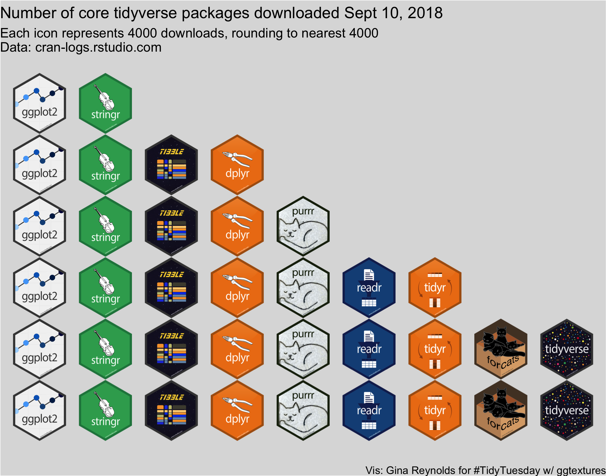

```{r setup, include=FALSE}
source("https://raw.githubusercontent.com/EvaMaeRey/little_flipbooks_library/master/xaringan_reveal_parentheses_balanced.R")
```

```{r, include = F}
knitr::opts_chunk$set(warning = F, message = F, cache = F, fig.width = 7, fig.height = 5.5, dpi = 300)
```

---

# Let's make this plot

```{r, out.width="65%", echo = F, fig.align='center'}

```


---
# Tidyverse packages used

There are in fact a number of ["core" tidyverse packages](https://www.tidyverse.org/) used in this demo!

- tibble
- ggplot
- stringr
- tidyr
- dplyr


Let's load these packages, with the `tidyverse` wrapper package that loads them all. 

```{r}
library(tidyverse)
```


---
# ggtextures

ggtextures is a new package under development by Claus Wilke which is available on github. 

https://github.com/clauswilke/ggtextures

It can be installed using devtools:

```{r, eval = F}
devtools::install_github("clauswilke/ggtextures")
```

We load this one, and a few others.

```{r}
library(ggtextures)
library(grid)
library(magick)
```

---
# Creating a tibble with the core tidyverse hex stickers


---

```{r tibble_of_stickers, eval=T, echo=F, comment = " "}
# vector of core tidyverse package names
c("ggplot2", "dplyr", "tidyr", "readr", "purrr",
  "tibble", "stringr", "forcats", "tidyverse") ->
package
# the paths of the hex stickers online
paste0("https://raw.githubusercontent.com/rstudio/hex-stickers/master/SVG/", 
       package, ".svg") ->
  hex_url
tibble(package,  
       hex = list(magick::image_read_svg(hex_url[1]),
                  magick::image_read_svg(hex_url[2]),
                  magick::image_read_svg(hex_url[3]),
                  magick::image_read_svg(hex_url[4]),
                  magick::image_read_svg(hex_url[5]),
                  magick::image_read_svg(hex_url[6]),
                  magick::image_read_svg(hex_url[7]),
                  magick::image_read_svg(hex_url[8]),
                  magick::image_read_svg(hex_url[9]))) ->
 core_w_hex_sticker 
```


`r apply_reveal("tibble_of_stickers")`


---
# Data preparation and plotting

Get the package download data for September 10, 2018 from cran-logs.rstudio.com.

```{r}
package_download_2018_09_10 <-
  read_csv("http://cran-logs.rstudio.com/2018/2018-09-10.csv.gz")
```


---

```{r plot, fig.width = 7, fig.height = 5.5, eval=F, echo=F, comment = " "}
package_download_2018_09_10 %>% 
  group_by(package) %>% 
  summarise(num_downloads = n()) %>% 
  right_join(core_w_hex_sticker) %>% 
ggplot() +
  aes(x = reorder(x = package, X = -num_downloads)) +
  # each sticker represents many downloads
  aes(y = round(num_downloads / 4000, 0)) + 
  aes(image = hex) + # hex column is list!
  # a column filled with the image
  ggtextures::geom_isotype_col() + 
  labs(title = "Number of core tidyverse packages downloaded Sept 10, 2018") +
  labs(subtitle = "Each icon represents 4000 downloads, rounding to nearest 4000\nData: cran-logs.rstudio.com") +
  labs(caption = "Vis: Gina Reynolds for #TidyTuesday w/ ggtextures") +
  theme_void(base_family = "") +
  theme(plot.background = 
          element_rect(fill = "gainsboro"))
```


`r apply_reveal("plot")`


---

# End

```{r, include = F}
if (!dir.exists("figures")) {dir.create("figures")}
save_complete_plot_from_chunk("isoplot")
```


```{css, eval = TRUE, echo = F}
.remark-code{line-height: 1.5; font-size: 70%}
```
