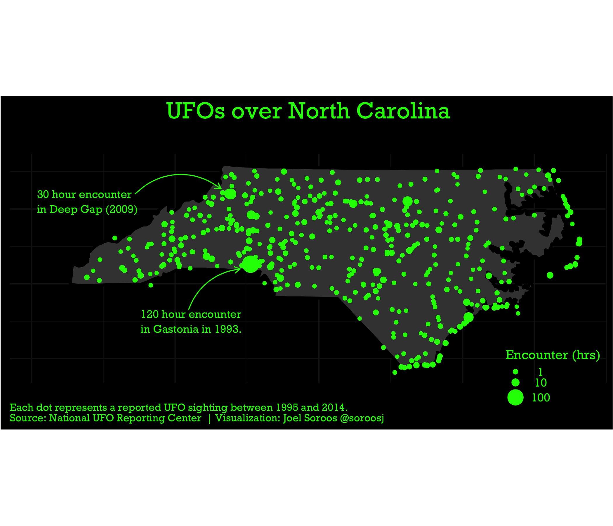
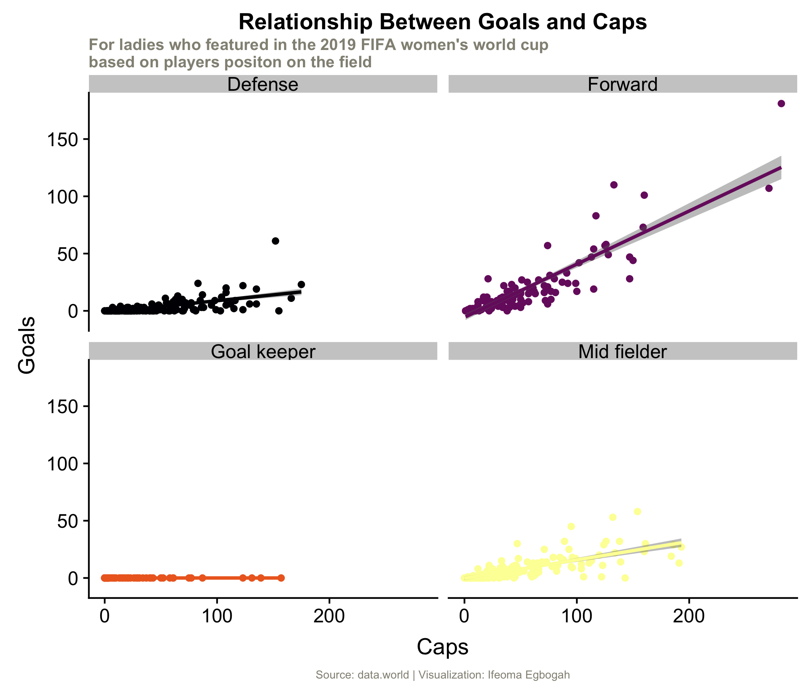
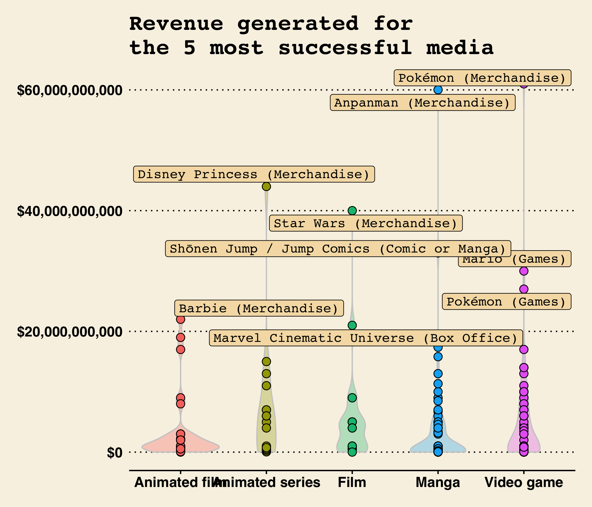

```{r setup, include=FALSE}
knitr::opts_chunk$set(echo = TRUE, warning = F, message = F, dpi = 300)
knitr::opts_chunk$set(fig.height = 6, out.width = "100%", comment = " ", cache = T)
source("https://raw.githubusercontent.com/EvaMaeRey/little_flipbooks_library/master/xaringan_reveal_parentheses_balanced.R")
```

---

# Table of contents

```{r, results='asis', echo=FALSE}
make_html_picture_link(link = "#ufo", path = "figures/ufo_theme.png")
make_html_picture_link(link = "#teacher", path = "figures/complete_teacher_student.png")
make_html_picture_link(link = "#worldcup", path = "figures/world_cup.png")
make_html_picture_link(link = "#franchises", path = "figures/top_5.png")
```


---

name: ufo

## Joel Soroos' *UFOs over North Carolina*

```{r, out.width="70%", echo = F}

```

---

```{r, child="ufos.Rmd"}
```


---

name: worldcup

## Ifeoma Egbogah's *Relationship Between Goals and Caps*


```{r, out.width="70%", echo = F}

```

---

```{r, child = "soccer.Rmd"}

```

---

name: teacher

## Christian Burkhart's *Some teachers have it tough*

```{r, out.width="70%", echo = F}
knitr::include_graphics("figures/student_teacher_ratio.png")
```

---

```{r, child="student_teacher_ratio.Rmd"}
```

---

name: franchises

## David Carayon's *Revenue generated for the 5 most successful media*

```{r, out.width="70%", echo = F}

```

---

```{r, child = "franchises.Rmd"}

```

---

```{css, eval = TRUE, echo = F}
.remark-code{line-height: 1.5; font-size: 65%}
```

```{r xaringan-themer, include = FALSE}
library(xaringanthemer)

# 
# xaringanthemer::write_xaringan_theme(text_font_size = ".75cm")

xaringanthemer::mono_light(
  base_color = "#1c5253",
  header_font_google = google_font("Libre Baskerville"),
  text_font_google   = google_font("Libre Baskerville", "150", "150i"),
  code_font_google   = google_font("Droid Mono"),
  text_font_size = "1cm",
  header_h1_font_size = ".7cm",
  code_font_size = ".3cm")
  
```
