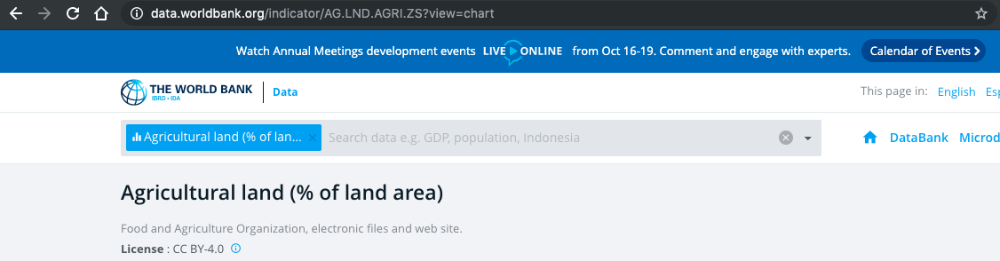

# Introduction

A package for accessing data via the World Bank's API (application programming interface) is [wbstats](https://cran.r-project.org/web/packages/wbstats/wbstats.pdf).  

This can actually give you cleaner data faster; the alternative is downloading indicators one by one and then cleaning and merging all the indicator data.  With the wbstats package you can request a number of indicators at once, and also ask for rather detailed description about the source of the indicator. 

The result below shows the result of requesting several indicators.  This returns a dataframe with rows defined by country and year, with three variables that are WB indicators.  Moreover, the package allows you to access fairly detailed information about the source for each indicator. 

Note: Another API to the World Bank website is WDI.

---

```{r, echo = F, message = F, warning = F}
source("../xaringan_reveal_parentheses_balanced.R")
knitr::opts_chunk$set(cache = T, message = F, warning = F)
library(gganimate)
```


---

# We load wbstats and the tidyverse

```{r}
library(wbstats)
library(tidyverse)
```

---

# Search data.worldbank.org for indicators of interest

Once you navigate to an indicator of interest, you will see its ID code in the web address (URL).

In the example below, the id is **AG.LND.AGRI.ZS**.

```{r, echo = F}

```


---

# Requesting data

We use the function wb() to request the indicators.

---

# Create an object that contains the all the names of the indicators of interest.

---

```{r indicators, eval = T, echo = F}
my_indicators <- c("SP.POP.GROW", 
                   "NY.GDP.PCAP.PP.CD", 
                   "AG.LND.AGRI.ZS")
```

`r apply_reveal("indicators")`


---

```{r request_data, eval = T, echo = F}
wb(country = "countries_only", # not regional aggregates
   # using the vector you just created set to indicator
   indicator = my_indicators,  
   mrv = 30, # 30 most recent values (mrv)
   return_wide = TRUE) ->
wb_data_raw
```

`r apply_reveal("request_data")`


---

```{r clean_data, eval = T, echo = F}
wb_data_raw %>% 
  # just using as_tibble to clean up the look of the data
  as_tibble() %>%    
  # replace current names to something more intelligable
  rename(pop_grow = SP.POP.GROW) %>% 
  rename(gdp_per_capita = NY.GDP.PCAP.PP.CD) %>% 
  rename(percent_ag_land = AG.LND.AGRI.ZS) %>% 
  mutate(date = as.numeric(date)) ->
wb_data
```


`r apply_reveal("clean_data")`


---

# Searching indicators

Another way of searching for indicators is using the wbsearch() `function`. 


```{r, eval = F}
wbsearch("population growth") 
wbsearch("food") 
```


---

# more detailed information...


```{r get_meta}
# requesting data on all the indicators, in English
wbindicators(lang = "en") %>% 
  # narrow to only cases where indicatorID 
  # is among (%in%) my_indicators 
  filter(indicatorID %in% my_indicators) ->
meta_data_wb_indicators
```


---

# Indicator short description

We can "pull" the short description for the indicators.


```{r short}
# short description.
meta_data_wb_indicators %>% 
  pull(indicator)
```

---

# More complete description

Or we can "pull" the full description.

```{r complete, return = "asis"}
# long description
meta_data_wb_indicators %>% 
  pull(indicatorDesc)
```


---

# wbsearch() function

Note that in addition to searching on the world bank webpage, you can also use the wbsearch function.  

```{r}
wbstats::wbsearch(pattern = "food")
```


---

# inspired wbstats

Well just getting the data is a little uninspiring.  Let's look at an example where we actually do something fun with them --- like create the "Hans Rosling Gapminder animation".  

You may have used the gapminder package.  The gapminder dataset in that package only contains every 5th year, but if you prefer to have data for every year, using the wbstats package is a good option.   

Let's see how Keith McNulty shows that in a single pipeline in R starting with accessing data via the World Bank API with the wbstats package, you can build the "Hans Rosling" animation.

<!-- The following work is pretty closely based on a [project by Keith McNulty](https://twitter.com/dr_keithmcnulty/status/1187149459588812800), which shows that in a single pipeline in R starting with accessing data via the World Bank API with the wbstats package, you can build the "Hans Rosling" animation.   -->

<!-- But we'll actually do this work in two steps: prepping the data, and then plotting.    -->

<!-- --- -->


<blockquote class="twitter-tweet" data-lang="en"><p lang="en" dir="ltr">Thanks to maggritr, wbstats and gganimate it is possible to create Hans Rosler&#39;s famous bubble chart in a single <a href="https://twitter.com/hashtag/rstats?src=hash&amp;ref_src=twsrc%5Etfw">#rstats</a> command.  Find me another language that can do this? (BTW here&#39;s my code <a href="https://t.co/gmafusMYqh">https://t.co/gmafusMYqh</a>) <a href="https://twitter.com/hashtag/datascience?src=hash&amp;ref_src=twsrc%5Etfw">#datascience</a> <a href="https://twitter.com/hashtag/analytics?src=hash&amp;ref_src=twsrc%5Etfw">#analytics</a> <a href="https://twitter.com/hashtag/r4ds?src=hash&amp;ref_src=twsrc%5Etfw">#r4ds</a> <a href="https://t.co/1zKhZl46dW">pic.twitter.com/1zKhZl46dW</a></p>&mdash; Keith McNulty (@dr_keithmcnulty) <a href="https://twitter.com/dr_keithmcnulty/status/1187149459588812800?ref_src=twsrc%5Etfw">October 23, 2019</a></blockquote>
<script async src="https://platform.twitter.com/widgets.js" charset="utf-8"></script>


---

```{r hans_data_raw, eval = F, echo = F}
# pull the country data down from the World Bank - three indicators
wbstats::wb(indicator = c("SP.DYN.LE00.IN", 
                          "NY.GDP.PCAP.CD", 
                          "SP.POP.TOTL"), 
            country = "countries_only", 
            startdate = 1960, enddate = 2018, 
            return_wide = TRUE) ->
wb_data_raw
```


<!-- --- -->

```{r hans_data, eval = F, echo = F}
wb_data_raw %>% 
  # rename indicator
  dplyr::rename(life_exp = SP.DYN.LE00.IN) %>%
  dplyr::rename(gdp_per_cap = NY.GDP.PCAP.CD) %>% 
  dplyr::rename(pop = SP.POP.TOTL) %>% 
  mutate(date = as.numeric(date)) %>% 
  # add countries to regions and join
  left_join(wbstats::wbcountries() %>% 
              select(iso3c, region)) ->
wb_data
```


<!-- --- -->

```{r hans_plot, eval = F, echo = F}
# plot the data
ggplot(data = wb_data) +
  aes(x = gdp_per_cap) +
  aes(y = life_exp) +
  geom_point(alpha = 0.5) +
  aes(size = pop) +
  aes(color = region) +
  # ensure correct points are 
  # are linked across time periods
  aes(group = country) +
  scale_size(range = c(.1, 16), 
             guide = FALSE) +
  scale_x_continuous(trans = "log10") +
  scale_y_continuous(limits = c(30, 90)) +
  scale_color_viridis_d() +
  labs(color = NULL) +
  labs(x = "GDP per capita (current US$)") +
  labs(y = "Life expectancy at birth") +
  theme_classic() +
  geom_text(aes(label = date,
                x = 3000, 
                y = 60),
            size = 14, 
            color = 'lightgrey') +
  # animate it over years
  gganimate::transition_states(date, transition_length = 1, state_length = 1) +
  gganimate::ease_aes('cubic-in-out')
```


<!-- --- -->

# A quick gganimate cautionary tale

gganimate will give you something without declaring groups (observations) across your time periods.  But you probaby want to go ahead and be explicit about the grouping.  Let's see how we might get some undesirable behavior using the shuffled gapminder dataset, first with out declaring the country to be the group for the geom across time periods, and then declaring this grouping. 

---

```{r caution_group, eval = F, echo = F}
library(gganimate)
library(gapminder)
gapminder %>% 
  sample_frac(size = 1, replace = F) %>% 
  ggplot() +
  aes(x = gdpPercap, y = lifeExp, size = pop, colour = continent) +
  geom_point(alpha = 0.7, show.legend = FALSE) +
  scale_size(range = c(2, 12)) +
  scale_x_log10() +
  facet_wrap(~ continent) +
  # Here comes the gganimate specific bits
  labs(title = 'Year: {frame_time}', 
       x = 'GDP per capita', 
       y = 'life expectancy') +
  gganimate::transition_time(year) +
  gganimate::ease_aes('linear') + #REVEAL
  aes(group = country) #REVEAL
```

`r apply_reveal("caution_group", user_reveal_defined = T)`

---

```{r}
knitr::opts_chunk$set(eval = F)
```


```{r, include = F, eval = F}
library(countrycode)
library(ggrepel)
options(scipen = 10) # sci. notation turns on later
```

```{r gg_scatterplot, include = F, eval = F}
wb_data %>%
  filter(date == 2014) %>%
  mutate(continent =
           countrycode(sourcevar = iso3c,
                       origin = "iso3c",
                       destination = "continent")) %>%
  ggplot() +
  aes(x = pop_grow) +
  aes(y = malnutrition) +
  geom_point() +
  scale_x_log10() +
  aes(color = continent) +
  geom_smooth(method = "lm") +
  facet_wrap(~ continent) +
  scale_color_discrete(guide = F) +
  aes(label = country) +
  ggpmisc::stat_dens2d_filter(geom = "text_repel",
                              keep.fraction = 1/5,
                              size = 3)
```

---


```{r, include = F, eval = F}
map_data("world") %>% 
  ggplot() + 
  aes(x = long) +
  aes(y = lat) +
  geom_point(size = .001) +
  coord_map("mollweide") + # area preserving projection
  theme_void()


```


---

```{r, include = F, eval = F}
map_data("world") %>% 
  ggplot() +
  aes(x = long) +
  aes(y = lat) +
  geom_polygon(fill = "blue", alpha = .5) +
  aes(group = group)
```


```{r world_map_data, include = F, eval = F}
map_data("world") %>%
  mutate(iso3c = countrycode(sourcevar = region, "country.name", "iso3c")) %>%
  rename(polygon_regions = region) ->
  world_map
```

---


```{r joined_data, include = F, eval = F}
world_map %>%
  full_join(wb_data %>% filter(date == 2014)) ->
  world_map_wb_2014
```


```{r plot_maps, include = F, eval = F}
world_map_wb_2014 %>%
  filter(polygon_regions != "Antarctica") %>%
  ggplot() +
  aes(x = long, y = lat) +
  geom_polygon() + 
  aes(group = group) + 
  aes(fill = malnutrition) +
  coord_equal() +
  theme_void() +
  scale_fill_viridis_c(option = "magma")
```

---

```{css, eval = TRUE, echo = F}
.remark-code{line-height: 1.5; font-size: 50%}
```

